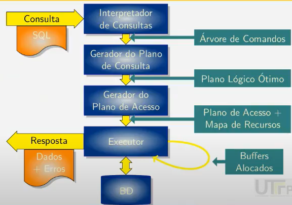
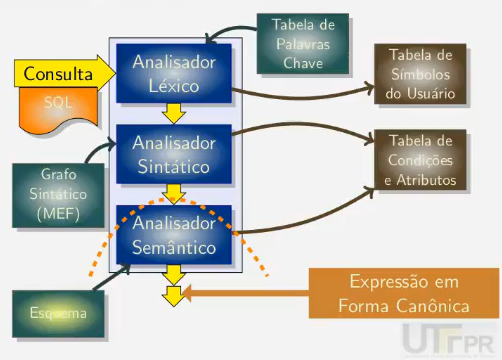

# Arquitetura de um SGDB



- O interpretador gera uma árvore de comandos canônica (da algebra relacional) que é gravada numa tabela

## Comandos SQL

### DCL

`CREATE DATABSE`, `SET TRANSACTION`, etc. São apenas compilados, mas tem execução sequencial

### DDL

`CREATE TABLE`, `ALTER TABLE`, `DROP INDEX`, etc. São traduzidos para comandos da *DML*. Ex: o `CREATE TABLE` é traduzido numa série de `INSERT`

### DML

`INSERT INTO`, `DELETE`, `UPDATE`, `SELECT`, etc. O comando `SELECT` podem e deve ser otimizado na hora de criar consultas.

## Interpretador de Consultas



Ex:

```sql 
SELECT <list_atr1>
FROM <relacoes>
WHERE <cond1>
GROUP BY <list_atr2>
HAVING <cond2>
ORDER BY <list_atr3>
```

Sequência de interpretação do banco:
- FROM
- WHERE
    - Comparação de atributos de mesma tabela
    - Comparação de atributos de tabelas diferentes (gera junção)
- GROUP BY (único comando que modifica a estrutura da tabela)
- HAVING
- ORDER BY
- SELECT (projeção)

> OBS: se na clausula WHERE sobrou tabelas que não foram comparadas / juntadas, será efetuada o produto cartesiano

## Gerador de planos de consulta

- Otimizador de expressões algébricas da tabela da forma canônica gerada pelo interpretador de consulta
- Ele gera vários planos de execução (com propriedades da algebra relacional, como associatividade, comutatividade, etc.), o avaliador de planos vai calcular o custo para executar cada um deles
- As operações mais básicas que o gerador de plano de consulta faz para otimizar uma consulta:
    - Antecipação da projeção
    - Merge das condições


> A quantidade de tabelas na clausula FROM pode causar uma quantidade de combinações grande, o que pode ser inviável para gerar várias consultas e escolher a melhor, nesse tempo que poderia ter executado a primeira e já executado a consulta.

Dentro do **Avaliador de planos lógicos** ele visa reduzir:
- O número de acessos ao disco (o mais custoso);
- O uso de memória;
- O uso do processador

### Seletividade

O banco de dados utiliza esse critério para utilizar uma consulta menos seletiva ou mais seletiva

$$ Seletividade(C_i) = 1 - \frac{Numero De Tuplas Do Resultado}{Numero De Tuplas Na Entrada} $$

## Gerador de plano de acesso físico

