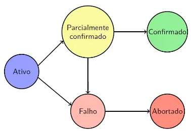

# Controle de transação e concorrência

## Transações

Uma **Transação** é um conjunto de um ou mais comandos SQL que, partindo de um estado consistente da base, sempre deixando a base consistente. **Uma transação é executada por completo ou não executa nada**.

O fluxo que o SGBD realiza para concluir uma transação é o seguinte:

```
Conecta com o Banco
    Começa a Transação
        Operação de consulta e atualização
        ...
    Finaliza Transação
    Começa a Transação
        Operação de consulta e atualização
        ...
    Finaliza Transação
    ...
    Finaliza Transação
Desconecta
```

Uma transação precisa estar em um dos seguintes estados:



> No estado "Parcialmente Confirmado" o SGDB escreve no log do banco para caso haja um problema / crash, o banco na hora da reconexão refaça as transações do estado onde pararam

## Gerenciamento de transações

Existem 3 grupos de eventos que podem danificar o conteúdo de uma base de dados:
- Erros de lógica em aplicativos;
- Falhas de hardware;
- Falta de sincronismo em acesso concorrente nas várias instâncias do aplicativo.

O controle das transações em um ambiente de concorrência é feito através do protocolo *Two Phase Commit*

## Controle de Concorrência

Uma **Execução Serial** de um conjunto de transações deixa a base de dados em um estado correto e consistente. Enquanto uma **Execução Intercalada** executa diversas transações intercalando os comandos.

Uma execução é dita **Serializável** quando uma execução intercalada tiver o mesmo resultado que uma execução serial.

Porém, dependendo a ordem com que os comandos de duas ou mais transações corretas são intercaladas, o resultado final pode não ser correto, ou seja, não existe uma sequência de transações executadas em série que gere o mesmo resultado. Existem três problemas de concorrência de uma intercalação incorreta:
- Perda de atualização
- Leitura inválida
- Análise inconsistente

### Protocolo baseado em bloqueio

É uma maneira de bloquear o acesso aos dados enquanto uma transação está acontecendo. Existem dois tipos de bloqueio
- **Compartilhado (Sharedlock)**: pode-se ler, mas não escrever
- **Exclusivo (Exclusivelock)**: pode-se ler e escrever

As regras de concessão de bloqueio são:

|   |      S     |      X     |
|:-:|:----------:|:----------:|
| S | Verdadeiro |    Falso   |
| X |    Falso   | Verdadeiro |

### Isolamento de transações

O SQL define 4 níveis de isolamento entre transações, quanto maior esse nível, menor a interferência entre elas, mas também as menores possibilidades de concorrência.

| Grau de isolamento | Leitura Inválida | Leitura Não Repetível | Leitura Fantasma |
|:------------------:|:----------------:|:---------------------:|:----------------:|
|  *Read Uncommitted*  |        Sim       |          Sim          |        Sim       |
|   *Read Committed*   |        Não       |          Sim          |        Sim       |
|   *Repeatable Read*  |        Não       |          Não          |        Sim       |
|    *Serializable*    |        Não       |          Não          |        Não       |

- **Leitura Inválida**: Realiza-se a leitura de um dado modificado por uma transação que ainda não terminou. Se a transação modificadora for cancelada, o dado não terá sido modificado.
- **Leitura Não Repetível**: Depois de lido um valor, a transação o lê novamente. Caso outra transação modificar esse dado, a leitura terá dois valores diferentes.
- **Leitura Fantasma**: Quando um transação lê todas as tuplas de uma relação. Então outra transação insere (ou atualiza) uma tupla dessa relação. Qualquer alteração na primeira vai afetar uma tupla que anteriormente não existia.

```sql
SELECT * FROM aluno
WHERE RA = '1234',
FOR UPDATE;

// Coloca um bloqueio exclusivo nos dados coerentes com o predicado, sendo "marcados" para atualização na sequência da transação
```

As mudanças de nível de isolamento precisa ser feito como a primiera instrução da transação. No JDBC é possível alterar da seguinte forma:
```sql
Connection.setTransactionIsolation(int level)
```

Também é possível remover o commit automático das instruções
```sql
Connection.setAutoCommit(false)
```

### Deadlock

O protocolo de bloqueio em duas fases garante que duas transações nunca interfiram uma na outra. Mas criam outro problema: **Bloqueio Perpétuo (Deadlock)**

## Comandos SQL

### SET TRANSACTION

```sql
SET TRANSACTION
    {{ READ { ONLY | WRITE } |
        ISOLATION LEVEL { SERIALIZABLE | REPEATABLE READ | READ COMMITTED | READ UNCOMMITTED }
    }}
```
Exemplo: 
```sql
SET TRANSACTION ISOLATION LEVEL READ COMMITTED READ ONLY;
```

### SAVEPOINT

Cria um *save point* em uma porção do código, após isso o banco salva essas informações no log para caso haja um problema durante a transação, ele é retornado a partir daquele ponto, é feito então um **rollback**.

```sql
SAVEPOINT <nome_savepoint>;
```

### RELEASE SAVEPOINT

Remove um savepoint

```sql
RELEASE { SAVEPOINT } <nome_do_savepoint>;
```

### COMMIT

Indica o termino bem sucedido de uma transação. Além de liberar memória de todos os savepoints.

```sql
COMMIT { WORK | TRANSACTION };
```

Um SGDB trata comandos de DDL da seguinte forma:

```
BEGIN
    COMMIT;
    // Comandos DDL
    COMMIT;
    EXCEPTION
        WHEN error THEN
            ROLLBACK;
            raise exception;
END:
```

Esse padrão pode ser modificado por um comando:
```sql
SET AUTOCOMMIT OFF;
```

### ROLLBACK

Finaliza uma transação corrente e restaura a base de dados de seu estado anterior

```sql
ROLLBACK { WORK | TRANSACTION };
ROLLBACK { WORK | TRANSACTION } TO { SAVEPOINT } <nome_do_savepoint>; 
```